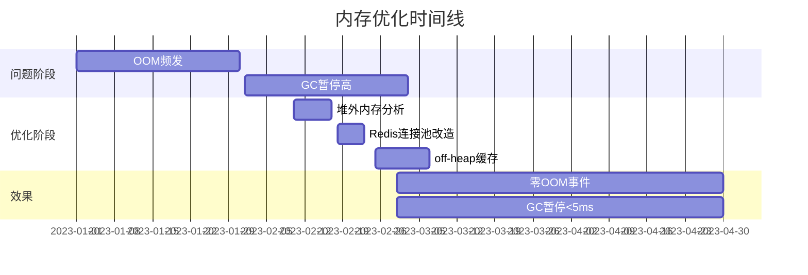

```mermaid
gantt
    title 内存优化时间线
    dateFormat  YYYY-MM-DD
    section 问题阶段
    OOM频发 :2023-01-01, 30d
    GC暂停高 :2023-02-01, 30d
    
    section 优化阶段
    堆外内存分析 :2023-02-10, 7d
    Redis连接池改造 :2023-02-18, 5d
    off-heap缓存 :2023-02-25, 10d
    
    section 效果
    零OOM事件 :2023-03-01, 60d
    GC暂停<5ms :2023-03-01, 60d
```