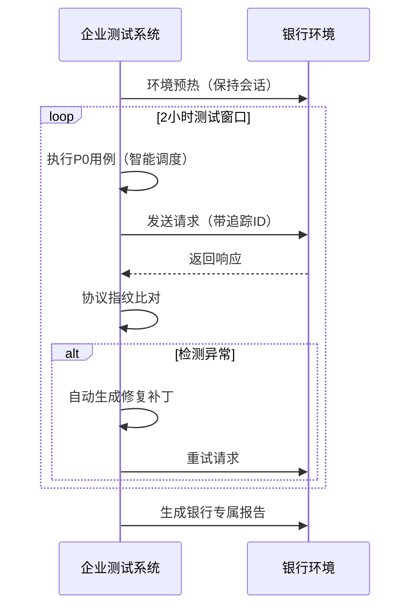

```mermaid
sequenceDiagram
    participant A as 企业测试系统
    participant B as 银行环境
    A->>B: 环境预热（保持会话）
    loop 2小时测试窗口
        A->>A: 执行P0用例（智能调度）
        A->>B: 发送请求（带追踪ID）
        B-->>A: 返回响应
        A->>A: 协议指纹比对
        alt 检测异常
            A->>A: 自动生成修复补丁
            A->>B: 重试请求
        end
    end
    A->>B: 生成银行专属报告


```